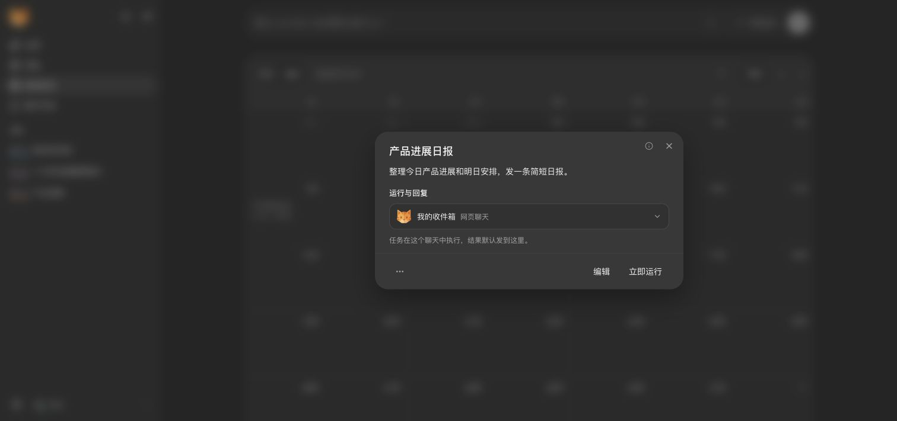
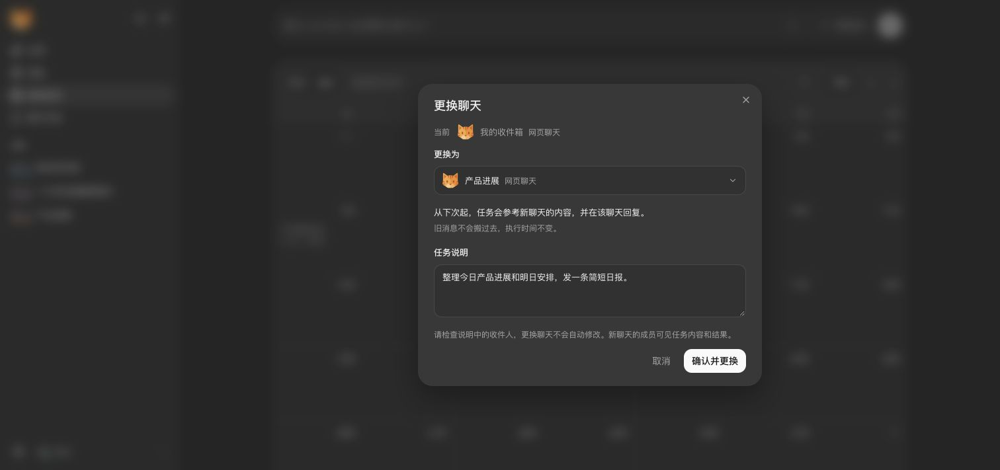

# Automation chat selection

Chat selection uses the production WebUI and Python gateway. The earlier
in-memory preview and its build transform have been removed.
See [the user guide](../../../docs/automations.md#change-the-chat-for-a-scheduled-task)
for the interaction, limits, and downgrade warning.

## Design decision

The concerns in [#5513](https://github.com/HKUDS/nanobot/issues/5513#issuecomment-5488297111)
and [#5620](https://github.com/HKUDS/nanobot/pull/5620#issuecomment-5534384796)
still apply: running in chat A and forwarding the result to chat B separates
the reply from its history and can expose context from A.

This implementation changes the whole binding for future runs: execution chat,
recorded turn, and default reply route. It does not add a delivery override or
copy old messages. New tasks start in their creation chat. A user can explicitly
change the whole binding for future runs.

The detail panel has one control, **Run and reply in**. It does not offer a
separate result recipient. The confirmation shows the current and new chats,
explains that old messages stay where they are, and shows read-only task
instructions. **Edit instructions** opens the text field only when needed, for
example to remove an old recipient. **Save and change** then saves both changes
together. Task name and schedule edits remain in the existing **Edit** dialog.

Cancel leaves the task unchanged. After saving, **Change back to** opens the same
confirmation for the previous chat; it does not silently undo a saved change.
The selector, confirmation, and saved status use the sidebar's display-name rule.
Current user-defined names take precedence over older API titles. Duplicate names
show a stable handle. All mutations still use the server-owned chat ID, not its name.

## Ownership and commit boundary

- The gateway resolves existing session handles, titles, canonical reply routes,
  channel availability, and effective workspace policy. The browser cannot submit
  a raw session key, channel, recipient, or topic address.
- `GET /api/webui/automations/chats?id=...` uses the existing API authentication.
  `automation.change_chat` uses the authenticated WebSocket mutation path. A
  direct HTTP mutation is rejected. Its values are `target_id`, `revision`, and
  the reviewed `message`.
- The gateway resolves the target again at save time. It rejects unknown,
  offline, foreign-scope, and unsupported targets. Topic address metadata is
  retained; sender identity and previous workspace policy are not copied.
- The cron owner compares the reviewed revision after merging pending CLI
  actions. It rejects while a scheduled turn owns a live execution snapshot,
  including one waiting in the agent queue. This first version conservatively
  blocks changes while any scheduled turn is active.
- One atomic write saves the whole binding and reviewed prompt before the new
  snapshot becomes live. A pre-commit write failure leaves the old state intact.
  If directory sync fails after replacement, the owner reads back that exact
  snapshot before reporting success. A binding version prevents an older CLI
  action snapshot from restoring the previous route.
- Each run retains its session identity. Before the first supported move, older
  run records are stamped with the known unchanged original binding. Audit result
  checks still verify job, run, session, status, and file path.
  History links use that run's WebUI chat key, not the task's current chat.
  External runs expose no recipient key and have no WebUI chat link.

No new execution path, agent-loop policy, dependencies, or separate CSS system
are added. The dialog uses the existing Select, Dialog, Button, Textarea, channel
logos, and DropdownMenu. The detail dialog owns the modal lock. Confirmation is
explicit and progress stays local to that action. The page remains visible.
Chat names and platform labels use separate lines. Task instructions use the
same quiet inset surface as other app dialogs. The confirmation and detail
panel share their action spacing; narrow screens can wrap long action labels.
While choices load, the known chat stays readable and the selector reports busy
to assistive technology. Saving reserves space for both button labels and keeps
the review visible until the host confirms. There is no optimistic route change
or loading overlay. This applies the continuity principle from
[The perfect app has no loading states](https://floriankiem.com/writing/the-perfect-app-has-no-loading-states)
without treating cached choices as permission to change a route.
The review keeps the selected and original chat identities across refreshes.
Their display names follow current sidebar names without changing either target.
If refreshed choices omit the selected chat, its name remains visible and saving
is disabled. The gateway still checks the route at save time.

The session details endpoint uses the same complete task serializer as the
Automations page. Both shared-dialog entry points receive the binding needed to
enable Run now and resume; neither client invents a missing route.

## Compatibility

The gateway advertises optional `webui.automation-chat.v1`; the core protocol
floor stays at 1. The optional `chat_binding_revision` job field exposes the
control only for supported jobs. A new client sends no new request to an old
host. An old client can keep using ordinary edits on a new host.

Storage paths and job IDs do not change. `bindingVersion` and per-run `sessionKey`
are additive fields with legacy defaults. The active instance still owns its
cron store and action log. **Downgrade after a move is not transparent**: follow
the backup/restore procedure in the user guide. Mixed-version cron writers after
a move are not supported. Rejected stale CLI updates are logged; retry the edit
from the current version after reading the latest task.

Explicit message-tool instructions can still override the default destination.
Prompt review is required, not automatic rewriting. The selector does not create
new isolation for shared workspace memory or files and does not guarantee that a
remote platform will accept delivery.

New reminders need only task instructions. The cron skill, tool descriptions,
and scheduled-turn prompt agree that nanobot sends the final reply to the saved
chat. Explicit separate sends and attachments still use `message`. Existing
instructions and recipients are not rewritten. The confirmation asks users to
check recipients, not remove intended broadcasts.

Scheduling uses the requested time and notification behavior, not repetition.
The always-loaded tool contract distinguishes cron schedules from flexible,
quiet heartbeat checks. Updated workspace templates and the cron skill use the
same rule. Existing workspace files and heartbeat tasks are not rewritten;
the user guide explains how to correct an old rule or an existing task.

These instructions are static. No per-run tool list, schema, or system prompt is
added. Updated tool descriptions and static scheduling rules can cause a cache
miss after the upgrade.
Task-specific instructions remain in the current user turn. Moving to another
chat intentionally changes the history; cache reuse must not override that.

## Verification

The focused regression suite exercises the actual HTTP/WebSocket gateway,
session manager, scheduler, agent queue, persistence, and audit reader. It
checks save/read-back, execution history and outbound topic routing, old results,
revision conflict, pre/post-replace errors, stale CLI actions, running jobs,
scope and route filtering, and old-host UI behavior.

The regression suite also checks follow-up model input in the new chat, a
background result after the parent turn's wait timeout, and confirmed or
cancelled deletion of the new WebUI chat. These use the existing session owner;
no separate delivery context is added to the agent loop.

The reply-contract test covers normal replies, legacy same-chat `message` calls
without duplicate replies, and multiple explicit recipients with attachments.
It compares serialized tools and system messages across ordinary turns, two
scheduled runs, and tool continuations. It also checks that continuation history
keeps structured tool calls and results. This is not a live provider cache-hit
measurement or proof that every model will follow the prompt.

Browser checks use the normal production build served by an isolated real
gateway. Chat data, model replies, and channel status are synthetic. Saves are
persisted to a temporary cron store; model network calls and external channel
senders are not started. Checks cover restart/read-back, running a saved task,
concurrent-edit rejection with retained draft, deletion cancellation, and
desktop/320 px/390 px layouts. This is not physical-iOS or real-platform delivery
acceptance. Raw test logs and local fixture state are kept outside the repository.

## Screenshots

Both screenshots show the production app connected to that isolated gateway.

